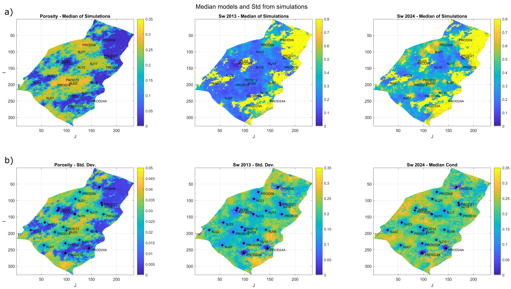

# GeoStatRockPhysics - Non-linear non-parametric geostatistical rock-physics inversion of elastic attributes

This repository contains supplementary material for the submission to Computers & Geosciences titled **Non-linear non-parametric geostatistical rock-physics inversion of elastic attributes for petrophysical properties using direct multivariate simulation**.

## Guide

The scripts *main_NorthSe_1dApplication.m* and *main_UNISIM_KDEDMS_TimeLapse.m* reproduces the results discussed in the Application section.

The repository uses an updated DMS version of the library SeReM as a submodule. 

Due to storage limitations of GitHub, the Folder *Data* is not uploaded in this repositoy. The files can be downloaded by using this link [LINK](https://drive.google.com/drive/folders/1b1PPqiAKjTFvPPE-if9Qe0skW4iLoZsg?usp=sharing)

## Abstract 

The estimation of subsurface petrophysical properties plays an essential role in the reservoir characterization process. In this work, we present a novel algorithm for geostatistical rock-physics inversion of elastic properties, assuming a non-linear forward model and a non-parametric multivariate joint distribution. The inversion methodology is mainly based on the numerical solution for data conditioning of the joint probability distribution. The proposed approach combines statistical rock-physics theory with stepwise conditional transformation, which is usually applied for non-parametric geostatistical simulations. Specifically, we apply data conditioning approach of the Direct Multivariate Simulation technique to obtain the petrophysical properties conditioned to elastic properties. The approach can be applied to estimate median models or to simulate multiple non-parametric geostatistical realizations conditioned on hard data. We validate the approach through two applications: a real 1D case using borehole well logs, and a synthetic time-lapse inversion with a 7-variate joint distribution. We discuss the computational advantages of the implementation, particularly in terms of RAM usage, allowing for the application to high-dimensional problems. The algorithm effectively preserves the non-linear and heteroscedastic relationships among variables, providing accurate estimations of petrophysical properties while maintaining spatial correlations and incorporating hard data conditioning.

